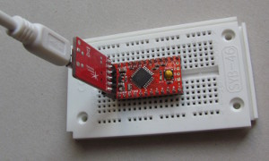
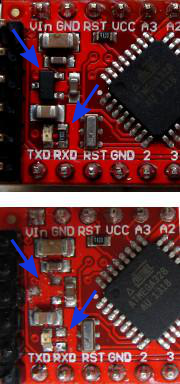
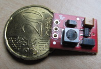
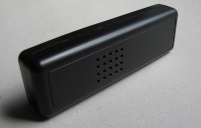

# Drahtloser 868 MHz Temperatur- und Luftfeuchtesensor kompatibel zum S 300 TH

Martin Kompf (https://www.kompf.de/tech/rftemp.html)  
  
 
Seit Jahren betreibe ich meine [Hobbywetterstation](</weather/index.html>) auf Basis der WS 300 Basisstation von ELV, einem USB-Wetterdatenempfänger USB-WDE 1 und diverser drahtloser Temperatur- und Luftfeuchtesensoren, wie dem S 300 TH vom gleichen Hersteller. Mittlerweile sind diese Sensoren kaum noch erhältlich. Muss ich bei einer geplanten Erweiterung nun das ganze System wechseln oder ist ein Selbstbau der drahtlosen Sensoren möglich?

### Die Zutaten: TX868, HTU21D ...

Die Sensoren übertragen die Messdaten - Luftfeuchte und Temperatur - in regelmäßigen Abständen drahtlos auf 868,35 MHz zur Basisstation. Das kann entweder eine Anzeigeeinheit wie die WS 300 sein oder der USB-Wetterdatenempfänger USB-WDE1, der die empfangenen Daten über eine serielle Schnittstelle einem Computer zur Weiterverarbeitung bereitstellt. Die Lösung ist in [Wetterdatenerfassung mit dem USB-WDE1](</weather/technik.html>) ausführlich beschrieben. Das Protokoll der drahtlosen Messwertübertragung ist [gut dokumentiert](<http://www.dc3yc.homepage.t-online.de/protocol.htm>), es lässt sich aber auch per [Reverse-Engineering mit einem Software Defined Radio](</weather/rtlsdrsensor.html>) ermitteln.

Glücklicherweise bietet ELV mit dem [HF-Sendemodul TX868](<https://de.elv.com/hf-sendemodul-tx868-75-868-mhz-062011>) die Kernkomponente für einen drahtlosen Sensor an. Das Modul sendet mit 868,35 MHz genau auf der geforderten Frequenz. Über einen Steuereingang lässt sich der HF-Träger ein- und ausschalten, die Modulationsart entspricht damit einem einfachen [On-off keying](<https://en.wikipedia.org/wiki/On-off_keying>). Bei der Implementierung des Übertragungprotokolls hat man somit alle Freiheiten. Der weite Betriebsspannungsbereich von 2 bis 3 V und der geringe Ruhestromverbrauch von 10 nA erlauben eine Batteriestromversorgung, zum Beispiel mit zwei AAA Zellen.

Die Wahl für den Sensor zur Messung von Temperatur und Luftfeuchte fiel auf den [HTU21D](<http://cdn.sparkfun.com/datasheets/BreakoutBoards/HTU21D.pdf>). Er integriert beide Sensoren in ein Gehäuse und stellt die Messwerte über ein I²C Interface bereit. Mit einer Versorgungsspannung von 1,5 bis 3,6 V und einer typischen Ruhestromaufnahme von 0,02 µA ist er ebenfalls für Batteriebetrieb geeignet. Problematisch für den Hobby-Maker ist das kleine Dual Flat No leads (DFN) Gehäuse des HTU21D, welches sich in der Hobby-Werkstatt kaum verarbeiten lässt. Hier greift man besser auf ein entsprechendes Breakout Board zurück, zum Beispiel von [Sparkfun](<https://www.sparkfun.com/products/12064>) oder [DX](<http://www.dx.com/p/htu21d-humidity-and-temperature-sensor-breakout-384251>).

### ... und Arduino Pro Mini

<b>Abb. 1</b>: Zum Programmieren des Wattuino Pro Mini muss man einen USB-Seriell Adapter aufstecken.

Die Ansteuerung von Sensor und Sendemodul übernimmt ein frei programmierbarer Mikrocontroller. Um den Aufwand für die Softwareentwicklung sowie die elektrische und mechanische Verarbeitung gering zu halten, sollte ein Arduino zum Einsatz kommen. Nun ist die Arduino Plattform nicht gerade für den energiesparenden Batteriebetrieb geeignet, obwohl die zugrundeliegende ATmega Plattform durchaus verschiedenste Methoden zur Reduzierung des Energieverbrauchs unterstützt. Daher sind weitere hardware- und softwareseitige Tuning-Maßnahmen erforderlich.

Zum Einsatz kommt zunächst ein sehr spezielles Arduino Board: Der Arduino Pro Mini, hier in der konkreten Inkarnation eines [Wattuino Pro Mini 3.3V/8MHz](<http://www.watterott.com/de/Wattuino-pro-mini-3V3-8MHz>) von Watterott. Dieses sehr kleine Board hat einen ATmega 328P aufgelötet, der diverse Stromspar-Modi beherrscht und sich prinzipiell bis hinab zu 1,8 V betreiben lässt - dazu später mehr.

<b>Abb. 2</b>: Die Reduzierung des Stromverbrauchs erfolgt durch Auslöten des Spannungsreglers und des Vorwiderstands der Power-LED (oben: vorher, unten: nachher).

Desweiteren hat der Wattuino Pro Mini keinen aufgelöteten USB-Seriell Wandler. Der ist für den Normalbetrieb auch nicht notwendig, seine Nichtexistenz spart daher weitere Energie. Um die notwendige Software auf den Wattuino aufspielen zu können, benötigt man allerdings einen [externen USB-Seriell Wandler](<http://www.watterott.com/de/FTDI-Breakout-Reloaded-V2>), der während des Programmiervorgangs auf den Wattuino aufgesteckt wird (Abb. 1). Er kann während des Testbetriebs auch die Stromversorgung übernehmen. Die Pfostenleiste für den USB-Seriell Adapter auf dem Wattuino habe ich von oben bestückt, damit eine Programmierung auch noch im eingebauten Zustand möglich ist.

Auf dem Wattuino Board befinden sich neben dem ATmega 328P noch zwei weitere aktive Bauelemente, die zum Stromverbrauch beitragen: Zum einen der 3,3 V Spannungsregler U2 und zum anderen die Power-LED, die über einen Widerstand von 1 kΩ permanent über 1 mA Strom zieht. Von beiden Bauelementen sollte man sich daher bei einem geplanten Batteriebetrieb trennen. Das Auslöten lässt sich mit einem feinen Lötkolben, einer Lupenleuchte und etwas Vorsicht durchaus bewerkstelligen. Ich habe allerdings nicht die Power-LED selbst, sondern ihren Vorwiderstand R3 entfernt (Abb. 2).

<b>Abb. 3</b>: Eine Lötbrücke auf dem HTU21D Breakout verbindet die Pull-up Widerstände mit dem I²C Bus.

Auf dem HTU21D Breakout Board befinden sich zwei Pull-up Widerstände, die einen korrekten Pegel für den I²C Bus sicherstellen. Zur Verbindung dieser Widerstände mit dem Bus musste ich die Lötbrücke auf dem Board mit Zinn versehen (Abb. 3).

Die Zusammenschaltung der Komponenten zeigt Abb. 4. Ein zusätzlicher Step-up Wandler gewährleistet eine bessere Ausnutzung der Batteriekapazität, dazu mehr im Abschnitt [Batteriebetrieb](<#batteriebetrieb>). Der DIP-Schalter dient zur bequemen Selektion der Adresse des Sensors. Diese Adresse ist Bestandteil des gesendeten Datenpakets und erlaubt der Basisstation die Unterscheidung mehrerer Sensoren. Es sind acht verschiedene Adressen möglich. Natürlich kann man auch auf den DIP-Schalter verzichten und die Adresse hart in der Software verankern.

 

<b>Abb. 4</b>: Zusammenschaltung der Komponenten

### Software

Das Auslesen von Luftfeuchtigkeit und Temperatur aus dem HTU21D über den I²C Bus erfolgt unter Zuhilfenahme der [SparkFunHTU21D Library](<https://github.com/sparkfun/SparkFun_HTU21D_Breakout_Arduino_Library>). Zur Ansteuerung des Sendemoduls TX868 habe ich die Arduino Library [TempHygroTX868](<https://github.com/skaringa/TempHygroTX868>) entwickelt, die ebenfalls auf Github zur Verfügung steht. Die Library versendet Temperatur und Luftfeuchte zusammen mit den erforderlichen Prüfsummen und Synchronisationsbits in einem Datenpaket, das die Wetterdatenempfänger USB-WDE1 und IPWE 1 sowie die Basisstationen WS 200 und 300 von ELV empfangen und dekodieren können.

Die Integration der beiden benötigten Libraries HTU21D und TempHygroTX868 in die Arduino Entwicklungsumgebung erfolgt in der [üblichen Art und Weise](<https://www.arduino.cc/en/guide/libraries>). Damit lässt sich mit wenig Aufwand ein minimaler Arduino-Sketch Programmieren und in den Wattuino laden (Board: Arduino Pro Mini, Processor: ATmega328 3.3 V, 8 MHz), der in regelmäßigen Abständen Temperatur und Luftfeuchte vom HTU21D abfragt und über den TX868 versendet:

<pre>#include &lt;TempHygroTX868.h&gt;
#include &lt;Wire.h&gt;
#include &lt;SparkFunHTU21D.h&gt;

HTU21D htu;
TempHygroTX868 tx;

void setup()
{
  htu.begin();
  tx.setup(5); // TX868 is at data pin 5
}

void loop()
{
  byte address = 3;
  float humidity = htu.readHumidity();
  float temperature = htu.readTemperature();

  tx.setAddress(address);
  tx.send(temperature, humidity);

  delay((unsigned¨NBSP;long)tx.getPause() * 1000UL);
}
</pre>

Die Software Pendants für Sensor und Transmitter sind die Klassen HTU21D und TempHygroTX868. Die globalen Variablen htu und tx nehmen jeweils eine Instanz dieser Klassen auf. In der setup() Methode erfolgt dann die einmalige Initialisierung der externen Hardware, tx.setup() bekommt dabei die Nummer des digitalen Ports übergeben, an welchem der TX868 hängt. Die loop() Funktion liest Luftfeuchte und Temperatur vom HTU21D aus und übergibt die Messwerte an die Funktion tx.send(), die das Datenpaket auf 868,35 MHz versendet. Danach pausiert das Programm mittels delay() die Ausführung. Das ist notwendig, da man im 868 MHz Band keinesfalls dauernd senden darf, sondern nur 36 Sekunden pro Stunde. Die Pausenlänge ist dabei nicht fest kodiert, sondern es geht die Adresse des Sensors mit ein. Damit wird verhindert, dass zwei Sensoren immer zur gleichen Zeit senden und ihre Signale gegenseitig stören.

### Batteriebetrieb

Als Stromversorgung dienen zwei AAA Alkali-Mangan Batterien, die im neuen Zustand eine Spannung von etwa 3 V liefern und eine Kapazität von durchschnittlich 1200 mAh haben sollen. Die Messung des Stromverbrauchs der kompletten Schaltung im Ruhezustand ergibt zur Zeit einen Wert von etwa 4 mA. Damit wären die Batterien nach spätestens 300 h (knapp zwei Wochen) leer. Da die hardwareseitigen Maßnahmen zur Reduzierung des Stromverbrauchs (Auslöten R3 und U2) ausgereizt sind, muss eine weitere Verringerung softwaretechnisch erfolgen.

Die Ursache für den hohen Ruhestromverbrauch ist die Tatsache, dass der ATmega auch während der delay() Anweisung aktiv bleibt. Will man den Stromverbrauch weiter verringern, muss man ihn in den Power-down Mode versetzen. Dazu sind verschiedene Modifikationen an der Software notwendig. Die letztendlich eingesetzte Software ist Bestandteil der TempHygroTX868 Library als Sketch TX868_HTU21_LowPower

 im examples

 Verzeichnis. Man kann ihn auch direkt [auf Github einsehen](<https://github.com/skaringa/TempHygroTX868/blob/master/examples/TX868_HTU21_LowPower/TX868_HTU21_LowPower.ino>).

Der entscheidende Code steckt in der Funktion pwrDownSleep(), die immer am Ende von loop() aufgerufen wird: Nach einigen vorbereitenden Maßnahmen, wie dem Abschalten des Analog-Digital-Wandlers, versetzt der Aufruf von sleep\_cpu() den ATmega in den Power-down Schlafzustand, in dem er typischerweise nur noch 0,1 µA verbraucht! Die nächste Anweisung - sleep\_disable() - kommt erst dann zur Ausführung, wenn die CPU wieder aufwacht. Dazu benötigt man einen Interrupt, den in der vorliegenden Lösung der Watchdog-Timer des ATmega auslöst.

Den Watchdog-Timer muss man explizit konfigurieren und einschalten. Dazu dienen die Programmzeilen am Ende der setup() Funktion, die das (maximale) Auslöseintervall von ca. 9 Sekunden einstellen. Das Auslösen des Watchdog-Timers führt dann zum Aufruf der Interrupt Service Routine ISR(WDT\_vect), welche die Zählvariable nextTxTimer

 herunterzählt. Das Programm arbeitet dann den Rest der Funktion pwrDownSleep() ab, die die CPU wieder in den normalen Arbeitszustand versetzt. Diese startet die loop() Funktion erneut, die unmittelbar prüft, ob nextTxTimer

 klein genug ist, um eine erneute Messung und Datenübertragung abzuarbeiten. Falls nicht, dann geht die Kontrolle sofort wieder an pwrDownSleep() über, die den ATmega erneut in den Schlafzustand versetzt.

Die Genauigkeit des Auslöseintervalls des Watchdogs ist nicht sehr hoch, sie hängt von Betriebsspannung und Temperatur ab. Damit erreicht man nicht die exakten Pausenzeiten gemäß Spezifikation, das sollte jedoch in der Praxis kein Problem darstellen.

Der Watchdog-Timer verbraucht eine geringe Menge zusätzlicher Energie, laut Datenblatt liegt der Ruhestromverbrauch dann bei 4,2 µA. Eine Messung am Gerät bestätigt exakt diesen Wert. Nimmt man weiterhin eine Batteriekapazität von 1200 mAh, einen Betriebsstromverbrauch während des Sendens von 15 mA über eine Dauer von 1 s sowie Ruhepausen von 170 s an, dann ergibt sich eine theoretische Lebensdauer der Batterien von anderthalb Jahren.

Allerdings wird man diesen Wert nicht erreichen. Der Grund dafür ist, dass die Batteriespannung während der Lebenszeit der Batterie nicht konstant bleibt, sondern bei zwei in Reihe geschalteten Zellen von 3,1 Volt auf 1,0 bis 1,4 Volt am Ende der Lebensdauer abfällt. Der im Wattuino Pro Mini verbaute ATmega 328P funktioniert bei einer Taktfrequenz von 8 MHz jedoch nur bis hinab zu 2,4 V. Außerdem ist der auf dem Chip enthaltene Brown-Out-Detector beim Arduino standardmäßig auf 2,7 V programmiert. Bei einem Absinken der Versorgungsspannung unter diesen Wert löst er einen Reset aus und blockiert damit die Programmabarbeitung. Diesen kritischen Wert von 2,7 V erreicht man jedoch schon nach etwa einem Viertel der Batterielebensdauer, sodass man realistisch von einem viertel Jahr Laufzeit mit einem Batteriesatz ausgehen kann.

<b>Abb. 5</b>: Ein kompletter 3,3 V Step-up Wandler auf Basis des NCP1402 ist kleiner als eine 20 Cent Münze!

Um die Batteriekapazität besser auszunutzen, habe ich meinem Mustergerät einen zusätzlichen Step-up Wandler auf Basis des NCP1402 spendiert. Er liefert aus einer variablen Eingangsspannung von 1 bis 3 V eine konstante Ausgangsspannung von etwa 3,3 V - es sind aber auch andere Ausgangsspannungen möglich. Dank Sparkfun gibt es ein [Breakout Board](<https://www.sparkfun.com/products/10967>), das neben dem NCP1402 alle weiteren erforderlichen Bauelemente - Spule, Kondensatoren und Diode - enthält (Abb. 5). Dieses Board ist nur 16 x 13 mm groß! Eine mir bekannte Bezugsquelle in Deutschland ist zum Beispiel [Exp-Tech](<http://www.exp-tech.de/sparkfun-ncp1402-3-3v-step-up-breakout-prt-10967>).

Der NCP1402 verbraucht im Ruhezustand typischerweise 30 µA. Damit steigt die Ruhestromaufnahme des Gerätes auf 35 µA. Mit den oben verwendeten Werten ergibt sich dann eine theoretische Batterielebensdauer von etwa einem Jahr. Diesen Wert sollte man aber auch in der Praxis erreichen, da der Step-up Wandler nun das Absinken der Batteriespannung kompensiert.

Um diese Berechnungen durch praktische Versuche zu bestätigen, habe ich in den Programmsketch meines Prototyps die kontinuierliche Messung der Batteriespannung integriert. Das Sendemodul überträgt die Spannung auf einer unbenutzter Adresse. Abb. 6 zeigt den Verlauf der Batteriespannung in Echtzeit.

<b>Abb. 6</b>: Echtzeitverlauf der Batteriespannung.

Die Messungen zeigen eine maximale Batterielebensdauer von acht Monaten. Das entspricht nicht ganz der berechneten Lebensdauer von einem Jahr. Gründe dafür sind die optimistisch veranschlagten Werte für die Batteriekapazität und der Wirkungsgrad des Step-up-Wandlers von nur 85 %. Dennoch ist die erreichte Batterielebensdauer von acht Monaten durchaus zufriedenstellend.

### Aufbau

<b>Abb. 7</b>: Blick in das fertig aufgebaute Gerät bei abgenommener oberer Gehäusehalbschale.

Alle benötigten Komponenten inklusive Batteriehalter für zwei AAA Zellen passen in ein Strapubox 6090 Gehäuse mit Batteriefach und den Abmessungen 129 x 40 x 24 mm (Abb. 7). Die Batterien sind in Abb. 7 nicht zu sehen, da sie von unten eingesetzt werden. TX868, Wattuino, der DIP Schalter und das HTU21D Breakout sind auf einer Universal Lochrasterplatte verlötet, die mit zwei Schrauben im Gehäuse befestigt ist. In der Oberschale des Gehäuses befinden sich einige Bohrungen, sodass der HTU21D mit der Außenluft in Verbindung steht. (Abb. 8).

### Fazit

<b>Abb. 8</b>: Das geschlossene Strapubox Gehäuse. Die Bohrungen dienen dem Luftaustausch zwischen Umgebung und Sensor.

Mit dem beschriebenen Konzept gelang der preiswerte Nachbau eines drahtlosen Temperatur- und Luftfeuchtesensors, der kompatibel zum nicht mehr produzierten S 300 TH von ELV ist. Ich kann daher meine seit vielen Jahren bestehende Wetterstation weiterbetreiben und erweitern. Der Umstieg auf ein neues System, das dann vielleicht auch nur ein oder zwei Jahre vertrieben wird, ist nicht notwendig. Das ist ein kleiner Beitrag zur sinnvollen Verwendung von Ressourcen und der Vermeidung von Abfall!

Ein zusätzlicher Step-up Wandler dient zur Stabilisierung der Betriebsspannung und gewährleistet damit eine maximale Auslastung der Batteriekapazität. Ein frischer AAA-Alkaline-Batteriesatz hält damit etwa acht Monate.

Und noch etwas weiteres fällt auf: Die drahtlose Kommunikation zwischen Sensor und Basisstation ist auf keinerlei Art und Weise gesichert! Jedermann ist in der Lage, entsprechende Sender zu betreiben und beliebige - reale oder faked - Messwerte in seiner Umgebung zu verteilen. Das können auch schon mal einige hundert Meter sein. Handelt es sich beim Empfänger um eine reine Anzeigestation, dann ärgert man sich nur über den schlechten Scherz eines «Witzboldes». Werden jedoch die empfangenen Messwerte zur Steuerung von Aktoren, wie einem Heizkessel oder einer Jalousie (in Abhängigkeit von der Windgeschwindigkeit) verwendet, dann kann die Angelegenheit schnell gefährliche Ausmaße annehmen. Generell muss man daher davon abraten, ein solches simples Drahtlossystem für kritische Aufgaben einzusetzen, es sollte auf den Hobbybereich beschränkt bleiben!

### Interessante Links

- [Sourcecode](<https://github.com/skaringa/TempHygroTX868>) auf Github
- [Arduino](<http://www.arduino.cc>) \- Offizielle Seite zu Hard- und Software
- [Wattuino](<https://github.com/watterott/wattuino>) auf Github
- [HTU21D Hookup Guide](<https://learn.sparkfun.com/tutorials/htu21d-humidity-sensor-hookup-guide>) von Sparkfun
- [SparkFun 3.3V Step-Up Breakout](<https://www.sparkfun.com/products/10967>) \- NCP1402
- [Datenprotokoll](<http://www.dc3yc.homepage.t-online.de/protocol.htm>) der ELV Sensoren

<!-- -->

